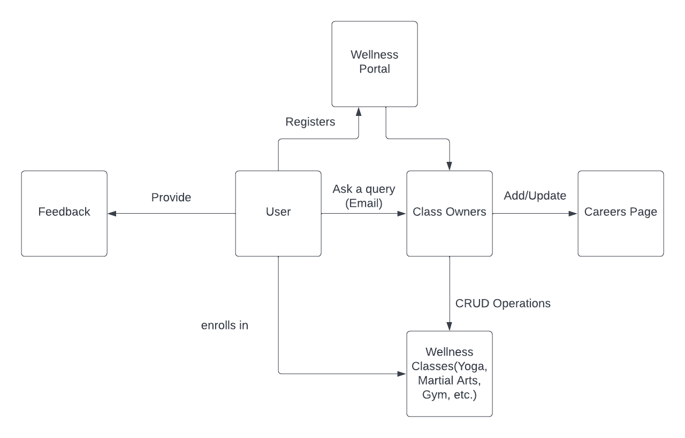

# final-project-Classpass
final-project created by GitHub Classroom

Team - Classpass

Mital Rameshbhai Dudhat | 
Mrunal Sandeep Mahajan | 
Gauri Shrikant Pasarkar

#Project Description
Wellness portal (Classpass) is revolutionizing the fitness and wellness industry by bringing together the world’s best classes and experiences into one website.
Whether you hit up a HIIT class, unwind with a massage, stream a class from your home or reconnect with your inner high school tennis player, we make it easy to prioritize your health.

#Domain model

#User Stories
As a user, I should be able to register my new account
As a user, I should be able to login into my account
As a user, I should be able to update my preferences
As a user, I should be able to search for different classes
As a user, I should be able to register for the class
As a user, I should be able to email/contact the host of the class
As a user, I should be able to give feedback/reviews of the class(i.e that I have attended)
As a host, I should be able to add/update/delete class information.
As a user, I should be able to logout from my account